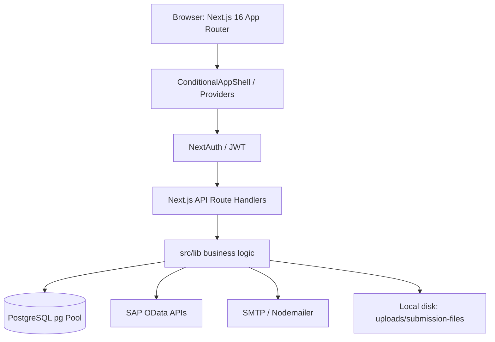
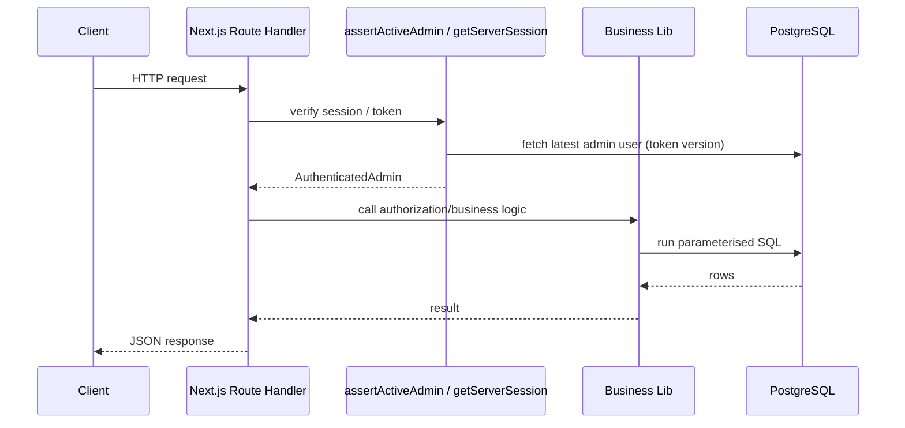

# IREB System — Comprehensive Technical Architecture Analysis

> **Analysis date:** 2026-08-05  
> **Codebase:** `D:/UOL/Ethical-Approval`  
> **Task type:** Analysis and documentation only. No code was modified.  
> **Scope:** Institutional Research Ethics Board (IREB) approval workflow for the University of Lahore.

---

## 1. Executive Summary

### 1.1 What the IREB System is

The **IREB System** (Institutional Research Ethics Board) is a web application for receiving, reviewing, approving, and reporting on ethics applications for research involving human subjects at the University of Lahore (UOL). It supports two applicant types — **thesis** and **research publication** — across **medical** and **non-medical** domains. Applicants sign in using UOL email addresses verified against SAP/ERP OData services, then submit an online ethics form. Submissions flow through a two-stage review: **supervisor review** (for students) and **IREB review**, before reaching a final **approved** or **rejected** status.

### 1.2 Overall Architecture

The system is a **full-stack Next.js 16 / React 19 / TypeScript** monolith using the **App Router** pattern. Backend logic lives in **Route Handlers** (`src/app/api/**/route.ts`) and shared libraries (`src/lib/...`). It uses a **PostgreSQL** database with direct `pg` driver (not Prisma) and a small migration-based schema evolution. Authentication is provided by **NextAuth v4** with two custom credential providers: one for applicants verified via SAP, and one for internal admin users. Authorization is role-based, with faculty/department/program scope restrictions for supervisors and IREB members.

### 1.3 Major Modules

| Module | Purpose |
|--------|---------|
| **Authentication** | NextAuth with Google GIS/SAP verification and admin credentials |
| **Profile / Forms** | Applicant-facing submission creation, drafts, and file uploads |
| **Submission Workflow** | Two-stage review (supervisor → IREB) with decisions, comments, and status transitions |
| **Admin / RBAC** | Administrator, supervisor, and IREB accounts with faculty/department/program scope |
| **Organizations** | Faculty, department, and program master data management |
| **Dashboard & Reports** | Charts, lead tables, printable aggregate reports, and Excel/CSV export |
| **Activity Log & Notifications** | Audit trail for every action, per-user notifications, and CSV/XLSX export |
| **Email** | SMTP-based confirmations, approvals, and rejection notifications |
| **File Storage** | Local disk storage of submission attachments with anti-traversal checks |

### 1.4 Technology Stack

| Layer | Technology |
|-------|------------|
| Framework | Next.js 16.1.6 App Router |
| UI Library | React 19.2.0, React DOM 19.2.0 |
| Language | TypeScript 5.x |
| Styling | Tailwind CSS 3.4.16, `clsx`, `tailwind-merge` |
| UI Kit | NextAdmin template (Free), `class-variance-authority` |
| Auth | NextAuth 4.24.14 (JWT sessions, custom credentials providers) |
| DB | PostgreSQL via `pg` 8.20.0, custom SQL |
| Password Hashing | `@node-rs/argon2` |
| Email | `nodemailer` 7.0.13 |
| Charts | `apexcharts` / `react-apexcharts` |
| PDF/Excel | `jspdf`, `html2canvas`, `xlsx` |
| Icons | `lucide-react` |
| Toast | `sonner` |
| Theme | `next-themes` |

### 1.5 High-Level Data Flow

1. Applicant signs in with a UOL email. `verify-student` or `verify-employee` SAP OData endpoint validates the user and returns name, SAP ID, faculty, department, and program.
2. Applicant selects a form (thesis vs publication; medical vs non-medical) and fills the online ethics form, uploading required documents.
3. On submission, the system creates a `submissions` row with a unique 6-digit `application_id`, inserts the applicant snapshot, research core, ethics JSON, timeline (thesis), and file attachments.
4. Student submissions start at `submitted` and proceed to `under_supervisor_review`. Faculty/staff submissions bypass the supervisor stage and go straight to `under_ireb_review`.
5. A supervisor or IREB member with the correct scope makes a decision. The decision is recorded in `approval_decisions` and the submission status is updated.
6. Emails are scheduled (fire-and-forget) on submission, supervisor rejection, IREB rejection, and IREB approval.
7. All actions are recorded in `activity_events` for audit and notifications.
8. Administrators and supervisors/IREB members view dashboards, leads reports, and printable reports scoped to their role and assigned faculties.

---

## 2. Overall Architecture

### 2.1 Frontend Architecture

- **Next.js 16 App Router** with a mix of Server Components (dashboards, form previews, static pages) and Client Components (interactive tables, settings, user forms).
- **Conditional rendering** based on `useSession()` from `next-auth/react` and `getServerSession(authOptions)` in server components.
- **No custom Next.js middleware** — route protection is implemented inline in server components and API routes.
- **Three layout modes** controlled by `ConditionalAppShell`:
  1. **Auth/Admin Login**: plain page, no shell
  2. **User shell**: header only, for `/profile/*` and `/pages/settings`
  3. **Admin shell**: sidebar + header + `ViewAsBanner`, for all authenticated admin users
- **State management**: `SessionProvider`, `ThemeProvider`, `SidebarProvider`; no Redux/Zustand. Data fetching via direct `fetch()` + `useState/useEffect`.

### 2.2 Backend Architecture

- **API layer:** Next.js Route Handlers (`src/app/api/**/route.ts`).
- **Business logic:** `src/lib/...` modules (auth, authorization, repositories, reports, email, activity log).
- **Database access:** a single global `pg.Pool` in `src/lib/db.ts`.
- **No ORM.** SQL is written directly with parameterised queries.
- **Security:** `assertActiveAdmin()` for admin API protection; `getServerSession()` for applicant API protection; `canAccessFacultySnapshot()` for faculty scoping.

### 2.3 Database Architecture

PostgreSQL with `BIGSERIAL`/`UUID` primary keys, PostgreSQL `ENUM` types for constrained values, `JSONB` for dynamic ethics payloads, and a mix of normalised and denormalised tables (e.g., `submission_applicant_snapshot` stores an ERP snapshot for historical accuracy).

### 2.4 API Communication

- Client components call route handlers with `fetch()` and `cache: "no-store"`.
- Server components can call lib functions directly.
- NextAuth callback route at `/api/auth/[...nextauth]/route.ts`.

### 2.5 Authentication Flow

```text
Applicant Browser
      |
      v
Google Identity Services / Manual email entry
      |
      v
POST /api/auth/verify-student
      |
      v
SAP OData (ZSTUDENTHMIS_SRV or Z_EMP_INFO_API_SRV)
      |
      v
NextAuth authorize('student-email') => JWT
      |
      v
Session cookie (next-auth.session-token)
      |
      v
Protected pages & API routes
```

### 2.6 Authorization Flow

```text
Request
   |
   v
getToken / getServerSession
   |
   v
parseEffectiveAdmin / adminFromSession
   |
   v
assertActiveAdmin (token version + active status check)
   |
   v
Role check (administrator / supervisor / ireb)
   |
   v
Faculty scope resolution (admin_faculty_assignments / admin_department_assignments / admin_program_assignments)
   |
   v
canAccessFacultySnapshot / canAccessSubmissionStage
   |
   v
Business logic / data access
```

### 2.7 Architecture Diagram (Mermaid)



---

## 3. Technology Stack

| Technology | Version | Purpose |
|------------|---------|---------|
| `next` | ^16.1.6 | App Router, SSR/SSG, API routes |
| `react` / `react-dom` | ^19.2.0 | UI library |
| `next-auth` | ^4.24.14 | Session/JWT authentication, credentials providers |
| `pg` | ^8.20.0 | PostgreSQL driver |
| `@node-rs/argon2` | ^2.0.2 | Admin password hashing |
| `tailwindcss` | ^3.4.16 | Utility-first CSS |
| `clsx` / `tailwind-merge` | latest | Conditional / merged class names |
| `class-variance-authority` | ^0.7.1 | Variants for `ui` components |
| `dayjs` | ^1.11.13 | Date formatting for reports and emails |
| `nodemailer` | ^7.0.13 | SMTP email sending |
| `apexcharts` / `react-apexcharts` | latest | Dashboard charts |
| `html2canvas` / `jspdf` | latest | PDF report export |
| `xlsx` | ^0.18.5 | Excel export for leads / activity events |
| `sonner` | ^2.0.7 | Toast notifications |
| `lucide-react` | ^1.18.0 | Icon set |
| `next-themes` | ^0.4.4 | Light/dark theme |

**Why this stack?** The project is based on the **NextAdmin** template and has been extended for IREB-specific workflows. Next.js App Router provides a single framework for server rendering and API routes. PostgreSQL with direct SQL keeps database code transparent and avoids the template's documented but removed Prisma setup. NextAuth avoids building a custom auth system.

---

## 4. Database Design

### 4.1 PostgreSQL Custom ENUMs

| Enum | Values |
|------|--------|
| `submission_type` | `thesis`, `publication` |
| `submission_domain` | `medical`, `non_medical` |
| `applicant_role` | `student`, `faculty` |
| `submission_status` | `draft`, `submitted`, `under_supervisor_review`, `supervisor_approved`, `supervisor_rejected`, `under_ireb_review`, `approved`, `rejected` |
| `review_stage` | `supervisor`, `ireb` |
| `review_decision` | `approved`, `rejected` |
| `upload_stage` | `submission`, `supervisor_review`, `ireb_review` |
| `uploader_role` | `student`, `faculty`, `supervisor`, `ireb` |
| `participant_role` | `supervisor`, `co_supervisor`, `co_author`, `external_researcher` |
| `participant_source` | `internal_erp`, `external` |
| `admin_role` | `administrator`, `supervisor`, `ireb` |
| `admin_status` | `active`, `inactive` |
| `admin_assignment_type` | `supervisor_primary`, `ireb_scope` |
| `faculty_member_status` | `active`, `inactive` |

### 4.2 Core Tables

| Table | Purpose | Key Columns |
|-------|---------|-------------|
| `submissions` | Master submission record | `id`, `application_id` (6-digit, unique), `type`, `domain`, `applicant_role`, `current_status`, `submitted_at` |
| `submission_applicant_snapshot` | Historical copy of applicant identity at time of submission | `sap_id`, `name`, `email`, `faculty`, `department`, `program` |
| `submission_research_core` | Common research fields | `title`, `objectives`, `methodology`, `participants_range`, `research_population` |
| `submission_ethics_payload` | Flexible, form-specific ethics data | `ethics_json` (JSONB), `schema_version` |
| `submission_timeline` | Thesis date range | `start_date`, `end_date` |
| `submission_sdgs` | Many-to-many link to SDGs | `submission_id`, `sdg_id` |
| `sdg_goals` | SDG reference data | `id`, `code`, `name` |
| `submission_participants` | Supervisors, co-supervisors, co-authors, external researchers | `participant_role`, `source`, `sap_id`, `internal_*`, `external_*` |
| `approval_decisions` | Append-only decision history | `stage`, `decision`, `comment`, `decided_by_sap_id`, `decided_by_name`, `decided_at` |
| `submission_attachments` | File metadata | `upload_stage`, `file_type`, `original_filename`, `storage_key`, `uploaded_by_role`, `uploaded_by_sap_id` |

### 4.3 Organization / RBAC Tables

| Table | Purpose |
|-------|---------|
| `faculties` | Master faculty list (`code`, `name`, `is_active`) |
| `faculty_sap_aliases` | Normalised SAP faculty name variants for fuzzy matching |
| `departments` | Departments under faculties |
| `programs` | Programs under departments |
| `admin_users` | Internal admin accounts (`administrator`, `supervisor`, `ireb`) with password hash |
| `admin_faculty_assignments` | Faculty-level scope (`supervisor_primary` / `ireb_scope`) |
| `admin_department_assignments` | Department-level scope for supervisors |
| `admin_program_assignments` | Program-level scope for supervisors |
| `admin_audit_logs` | Legacy admin audit trail (JSONB) |
| `activity_events` | Primary activity / notification stream |
| `activity_notification_reads` | Per-admin "last read" cursor for notifications |

### 4.4 Faculty Member / SSO Tables

| Table | Purpose |
|-------|---------|
| `faculty_members` | Master staff/faculty list from CSV; `sap_id`, `status`, `is_google_sso_enabled` |
| `faculty_auth_accounts` | External auth identities (Google SSO linkage). **Note:** migration 007 drops this table, so it may not exist at runtime. |
| `user_profiles` | User-editable profile keyed by `sap_id` | `phone`, `bio`, `avatar_url`, `locale`, `notification_email` |

### 4.5 Relationships (ER Diagram Mermaid)

```mermaid
erDiagram
    submissions ||--|| submission_applicant_snapshot : "1:1"
    submissions ||--|| submission_research_core : "1:1"
    submissions ||--|| submission_ethics_payload : "1:1"
    submissions ||--o| submission_timeline : "1:1 thesis"
    submissions ||--o{ submission_sdgs : "many"
    sdg_goals ||--o{ submission_sdgs : "many"
    submissions ||--o{ submission_participants : "many"
    submissions ||--o{ approval_decisions : "append"
    submissions ||--o{ submission_attachments : "many"
    faculties ||--o{ departments : "1:N"
    departments ||--o{ programs : "1:N"
    faculties ||--o{ faculty_sap_aliases : "1:N"
    admin_users ||--o{ admin_faculty_assignments : "1:N"
    admin_users ||--o{ admin_department_assignments : "1:N"
    admin_users ||--o{ admin_program_assignments : "1:N"
    admin_users ||--o{ activity_events : "actor"
    admin_users ||--o{ admin_audit_logs : "actor"
    user_profiles ||--|| faculty_members : "by sap_id"
    faculty_members ||--o{ faculty_auth_accounts : "optional"
```



### 4.6 Indexes

- `idx_submissions_type`, `idx_submissions_domain`, `idx_submissions_status`
- `idx_applicant_department` on snapshot
- `idx_faculties_active`, `idx_departments_faculty`, `idx_departments_active`
- `idx_admin_department_assignments_admin` (partial: deleted_at IS NULL)
- `idx_admin_program_assignments_admin` (partial: deleted_at IS NULL)
- `idx_approvals_submission_stage`
- `idx_attachments_submission_stage`
- `idx_ethics_json_gin` (GIN index on JSONB)
- `uq_submission_internal_participant_role` (partial unique on `source = 'internal_erp'`)
- `uq_faculty_members_email_lower` (case-insensitive, partial on `deleted_at IS NULL`)

---

## 5. Authentication

### 5.1 Login Flow

**Applicant (student/faculty):**
1. Browser loads Google Identity Services and obtains an OAuth token.
2. Token email is verified against Google userinfo.
3. `POST /api/auth/verify-student` is called with the email.
4. Server calls SAP OData:
   - `@student.uol.edu.pk` → `ZSTUDENTHMIS_SRV`
   - Other UOL emails → `Z_EMP_INFO_API_SRV`
5. SAP returns student/faculty record (name, SAP ID, faculty, department, program).
6. Client calls `signIn("student-email")` with the verified email.
7. NextAuth `authorize` verifies the SAP record again and creates a JWT session.
8. Session cookie is set.

**Admin:**
1. User visits `/admin/login`.
2. Client calls `signIn("admin-credentials", { email, password })`.
3. NextAuth `authorize` hashes password with Argon2 and looks up `admin_users`.
4. On success, `buildAdminClaims` resolves scope and returns JWT.
5. Session cookie is set.

### 5.2 Session Management

- `strategy: "jwt"` with `maxAge: 30 * 24 * 60 * 60` (30 days).
- JWT is stored in a secure `next-auth.session-token` cookie.
- Token fields include `sapId`, `adminId`, `adminRole`, `adminStatus`, `adminScopeMode`, `adminFacultyIds`, `adminTokenVersion`, `actingAdminId`, `viewAsActive`, etc.

### 5.3 Refresh Tokens

**Not present.** NextAuth v4 with JWT strategy does not use refresh tokens. The session is valid for 30 days or until `token_version` changes or password changes.

### 5.4 Password Hashing

- `@node-rs/argon2` with:
  - `memoryCost: 19_456` KB
  - `timeCost: 2`
  - `parallelism: 1`

### 5.5 Middleware

**No custom Next.js middleware** exists. Authorization is performed inside each Route Handler and each protected Server Component.

### 5.6 Logout

Handled by `signOut()` from `next-auth/react`. Client calls `next-auth/signout` to clear the session cookie.

### 5.7 Security Considerations

- Admin token version is validated on each `assertActiveAdmin()` call; disabling/changing a user invalidates sessions.
- `assertActiveAdmin` checks both the effective and acting admin are active and token versions match.
- Faculty scope resolution is re-checked on every request.
- Path traversal is blocked in file storage functions.

---

## 6. Authorization (RBAC)

### 6.1 User Roles

| Role | Description |
|------|-------------|
| `administrator` | Full access; can manage users, organizations, forms; can view-as supervisor/IREB; can act on behalf of any supervisor/IREB for decisions |
| `supervisor` | Reviews student submissions at the supervisor stage; scoped to one primary faculty (optionally department/program) |
| `ireb` | Reviews all submissions after supervisor approval (or direct for faculty/staff); scoped to assigned faculties or all if no assignment |

### 6.2 Scope Modes

- `all` — administrators and unscoped IREB members.
- `restricted` — supervisor assigned to one faculty/department/program; IREB assigned to one or more faculties.

### 6.3 Permission Matrix (Role × Capability)

| Capability | `administrator` | `supervisor` | `ireb` | Applicant |
|------------|-----------------|--------------|--------|-----------|
| Submit ethics application | No | No | No | Yes |
| View own submissions | No | No | No | Yes |
| View dashboard | Yes | Yes (scoped) | Yes (scoped) | No |
| View leads/submissions list | Yes | Yes (scoped) | Yes (scoped) | No |
| View single submission | Yes | Yes (scoped) | Yes (scoped) | No |
| Supervisor decision | Yes (on behalf) | Yes (own stage) | No | No |
| IREB decision | Yes (on behalf) | No | Yes (own stage) | No |
| Manage users | Yes | No | No | No |
| Manage organizations | Yes | No | No | No |
| View forms catalog | Yes | No | No | No |
| View reports | Yes | Yes (some) | Yes (some) | No |
| View-as supervisor/IREB | Yes | No | No | No |

### 6.4 Route / API Protection

- **Server pages** use `getServerSession(authOptions)` and `redirect()` or `notFound()`.
- **Route Handlers** use `assertActiveAdmin()` or `getServerSession()`.
- **Faculty scope** is checked via `canAccessFacultySnapshot()` before serving a submission or making a decision.

### 6.5 Component-Level Authorization

- `ConditionalAppShell` only renders the admin sidebar if `session.user.adminRole` is present.
- Sidebar filters menu items: `/users`, `/organizations`, `/forms` are hidden for non-administrators.

---

## 7. User Management

### 7.1 User Types

1. **Applicants** — authenticated via SAP/Google, no record in `admin_users`.
2. **Admin users** — stored in `admin_users`.

### 7.2 Admin User Lifecycle

| Action | Route | Authorization |
|--------|-------|---------------|
| Create | `POST /api/admin/create-user` | Administrator only |
| List | `GET /api/admin/users` | Administrator only |
| Update | `PATCH /api/admin/users/[id]` | Administrator only |
| Delete | `DELETE /api/admin/users/[id]` | Administrator only (cannot delete self) |
| Activate/Deactivate | `PATCH /api/admin/users/[id]/status` | Administrator only |

### 7.3 Scope Assignment

- **Supervisor:** one primary faculty/department (and optionally program). Scope is stored in `admin_faculty_assignments`, `admin_department_assignments`, `admin_program_assignments` with `assignment_type = 'supervisor_primary'`.
- **IREB:** one or more faculty scopes. Stored in `admin_faculty_assignments` with `assignment_type = 'ireb_scope'`.
- On role change, all scope assignments are cleared and must be reassigned.

### 7.4 Password Management

- Passwords are hashed with Argon2.
- `token_version` increments on status change or manual password reset, invalidating existing sessions.

### 7.5 Profile Management

- All users (applicants and admins) can update `user_profiles` (phone, bio, avatar URL, locale, notification email).
- Avatar upload stores in `public/images/profile_images` with versioned filename.

### 7.6 Role Assignment

- `admin_users.role` is an `admin_role` ENUM.
- `created_by` records the creating administrator.

### 7.7 Organization Assignment

- Supervisors are tied to a faculty/department/program.
- IREB members are tied to one or more faculties.

---

## 8. Organization Structure

The system has a **faculty → department → program** hierarchy.

### 8.1 Hierarchy

```text
faculty (e.g., Faculty of Pharmacy)
  └── department (e.g., Department of Pharmacy Practice)
        └── program (e.g., Pharm-D)
```

### 8.2 Master Data Tables

- `faculties` (`code`, `name`, `is_active`)
- `departments` (`faculty_id`, `name`, `is_active`)
- `programs` (`department_id`, `name`, `is_active`)
- `faculty_sap_aliases` for SAP name variants

### 8.3 SAP Faculty Matching

Because SAP returns free-text faculty/department values, the system normalises them and tries to match against `faculty_sap_aliases` and `faculties` using `resolveFacultyIdsFromSnapshotValue()`.

### 8.4 Filtering

Reports and submission lists are scoped by resolved faculty ID. Department and program filters are used in the users/orgs UI and in reports.

---

## 9. Core Business Modules

### 9.1 Submission Module

**Purpose:** Create, edit, view, and manage ethics applications.

**Tables:** `submissions`, `submission_applicant_snapshot`, `submission_research_core`, `submission_ethics_payload`, `submission_timeline`, `submission_sdgs`, `submission_participants`, `submission_attachments`.

**APIs:**
- `GET/POST /api/profile/submissions` — list and create
- `POST /api/profile/submissions/draft` — save draft
- `GET/PATCH /api/profile/submissions/[id]` — view and edit draft
- `GET /api/profile/submissions/[id]/attachment` — download applicant file
- `GET/POST /api/submissions` — admin list
- `GET /api/submissions/[id]` — admin detail
- `POST /api/submissions/[id]/decision` — make supervisor/IREB decision
- `GET /api/submissions/[id]/attachment` — admin download

**Business Rules:**
- 6-digit `application_id` (100000–999999), unique, randomly allocated.
- Students (`@student.uol.edu.pk`) start at `submitted` → `under_supervisor_review`.
- Faculty/staff bypass supervisor and start at `under_ireb_review`.
- Drafts are owned by the authenticated SAP ID.
- Resubmission promotes an existing record, keeping the old `application_id`.

### 9.2 Approval / Decision Module

**Purpose:** Record supervisor and IREB approval/rejection decisions.

**Tables:** `approval_decisions`, `submissions`.

**APIs:**
- `POST /api/submissions/[id]/decision`
- `POST /api/submissions/[id]/dean-decision` (legacy alias)
- `POST /api/submissions/[id]/ireb-decision`

**Business Rules:**
- A decision is append-only (new row in `approval_decisions`).
- Rejection requires at least one reason code and an elaboration comment.
- Supervisor approval moves status to `under_ireb_review`.
- Supervisor rejection moves to `supervisor_rejected`.
- IREB approval moves to `approved`.
- IREB rejection moves to `rejected`.
- Administrator must select an `onBehalfOfAdminId` (supervisor or IREB) when acting.
- View-as mode allows an administrator to act with the permissions of a supervisor/IREB and adds an audit note.
- Decided-by fields store the SAP ID and name of the acting admin.

### 9.3 Form Module

**Purpose:** Render and validate the correct ethics form per application type, domain, and faculty.

**Files:** `src/app/profile/_components/forms/form-registry.ts`, `form1-thesis-form.tsx` through `form7-...tsx`.

**Business Rules:**
- Medical/health faculties (`Faculty of Pharmacy`, `Allied Health Sciences`, `Medicine & Dentistry`) trigger medical forms.
- `form1` and `form3` are for thesis; `form2`, `form4`, `form5`, `form6`, `form7` are for research publications.
- Faculty/staff use form 5/6/7 depending on medical domain.
- Forms include sections: research objectives, participants, informed consent, co-persons, SDGs, and required attachments.

### 9.4 Reports Module

**Purpose:** Generate analytical and printable reports.

**APIs:**
- `POST /api/admin/reports/[type]`
- `GET /api/admin/reports/report-filters`
- `GET /api/admin/reports/supervisors`

**Report Types:**
- `supervisors-report`
- `total-efficiency`
- `overall-research-specific`
- `overall-student`
- `overall-faculty`
- `faculty-wise-research`
- `department-wise-research`

**Business Rules:**
- Supervisors report is not available to IREB users.
- Date ranges limited to 10 years.
- Reports are HTML pages that can be printed / downloaded as PDF via `html2canvas` + `jsPDF`.
- Excel export is available for leads/activity events.

### 9.5 Dashboard Module

**Purpose:** Provide role-specific overview of submissions.

**Files:** `src/app/(home)/page.tsx`, `src/app/(home)/fetch.ts`, `src/app/SupervisorPanel/page.tsx`, `src/app/EthicalCommiteePanel/page.tsx`.

**Business Rules:**
- Overview cards show counts of total, pending, approved, and rejected requests.
- `UsedDevices` chart is renamed per role.
- `LeadsReport` table is scoped to admin role and faculty.
- Overdue detection uses 2-day threshold (`lead-overdue.ts`).

### 9.6 Activity Log / Notifications Module

**Tables:** `activity_events`, `activity_notification_reads`.

**APIs:**
- `GET/POST /api/activity-events`
- `GET /api/activity-events/filters`
- `GET/POST /api/activity-events/notifications`
- `GET /api/activity-events/export`

**Business Rules:**
- 16 action codes (e.g., `application.create`, `application.review.approve`, `user.activate`, `view_as.start`).
- Every decision, user change, profile update, and view-as action is logged.
- Notifications show recent events since `last_read_at`.
- Administrators see all events; supervisors/IREB see events where they are actor or effective actor.

### 9.7 User & Organization Module

**APIs:** `/api/admin/users`, `/api/admin/faculties`, `/api/admin/departments`, `/api/admin/programs`, `/api/admin/assign-faculty`.

**Business Rules:**
- Soft-delete via `deleted_at`.
- Only one active `supervisor_primary` per faculty (unique partial index).
- Cannot delete faculty/department/program if assigned to users.

---

## 10. APIs

A complete inventory was produced by the analysis. The following table summarises every route by feature area.

### 10.1 Authentication & Health

| Endpoint | Method | Auth | Description |
|----------|--------|------|-------------|
| `/api/auth/[...nextauth]` | GET, POST | NextAuth | All NextAuth callbacks |
| `/api/auth/verify-student` | POST | Public | Verify student/faculty email against SAP |
| `/api/admin/login` | POST | Public | Admin credential verification (custom provider) |
| `/api/db/health` | GET | Public | DB connectivity check |

### 10.2 Admin Management

| Endpoint | Method | Auth | Description |
|----------|--------|------|-------------|
| `/api/admin/users` | GET | Admin | List admin users |
| `/api/admin/users/[id]` | PATCH, DELETE | Admin | Update/delete admin user |
| `/api/admin/users/[id]/status` | PATCH | Admin | Activate/deactivate |
| `/api/admin/create-user` | POST | Admin | Create admin user |
| `/api/admin/assign-faculty` | POST | Admin | Assign supervisor/IREB scope |
| `/api/admin/faculties` | GET, POST | Admin | List/create faculties |
| `/api/admin/faculties/[id]` | PATCH, DELETE | Admin | Update/delete faculty |
| `/api/admin/departments` | GET, POST | Admin | List/create departments |
| `/api/admin/departments/[id]` | PATCH, DELETE | Admin | Update/delete department |
| `/api/admin/programs` | GET, POST | Admin | List/create programs |
| `/api/admin/programs/[id]` | PATCH, DELETE | Admin | Update/delete program |
| `/api/admin/bootstrap/faculties` | POST | Admin | Seed faculties |
| `/api/admin/bootstrap/supervisors` | POST | Admin | Bulk create supervisors |

### 10.3 View-As

| Endpoint | Method | Auth | Description |
|----------|--------|------|-------------|
| `/api/admin/view-as/options` | GET | Admin | List impersonation targets |
| `/api/admin/view-as/start` | POST | Admin | Start view-as |
| `/api/admin/view-as/stop` | POST | Admin | Stop view-as |

### 10.4 Submissions (Admin)

| Endpoint | Method | Auth | Description |
|----------|--------|------|-------------|
| `/api/submissions` | GET | Active admin | Scoped list |
| `/api/submissions/[id]` | GET | Active admin | Scoped detail |
| `/api/submissions/[id]/action-options` | GET | Active admin (administrator) | Pick supervisor/IREB for on-behalf decision |
| `/api/submissions/[id]/decision` | POST | Active admin | Main decision endpoint |
| `/api/submissions/[id]/dean-decision` | POST | Active admin | Supervisor-stage alias |
| `/api/submissions/[id]/ireb-decision` | POST | Active admin | IREB-stage alias |
| `/api/submissions/[id]/attachment` | GET | Active admin | Download attachment |

### 10.5 Profile / Applicant

| Endpoint | Method | Auth | Description |
|----------|--------|------|-------------|
| `/api/profile/me` | GET, PUT | Session | Get/update user profile |
| `/api/profile/me/avatar` | POST, DELETE | Session | Upload/remove avatar |
| `/api/profile/faculty-eligibility` | GET | Session | Check publication eligibility |
| `/api/profile/faculty-departments` | GET | Session/Admin | Hierarchy for form dropdowns |
| `/api/profile/submissions` | GET, POST | Session | List / create submission |
| `/api/profile/submissions/draft` | POST | Session | Save draft |
| `/api/profile/submissions/[id]` | GET, PATCH | Session | View / edit draft |
| `/api/profile/submissions/[id]/attachment` | GET | Session | Download own attachment |

### 10.6 Dashboard

| Endpoint | Method | Auth | Description |
|----------|--------|------|-------------|
| `/api/dashboard/data` | GET | Session | Dashboard overview charts/data |

### 10.7 Reports

| Endpoint | Method | Auth | Description |
|----------|--------|------|-------------|
| `/api/admin/reports/[type]` | POST | Active admin | Generate HTML report |
| `/api/admin/reports/report-filters` | GET | Active admin | Faculty/department filters |
| `/api/admin/reports/supervisors` | GET | Active admin (administrator) | Supervisor picker |

### 10.8 Activity / Notifications

| Endpoint | Method | Auth | Description |
|----------|--------|------|-------------|
| `/api/activity-events` | GET | Active admin | Paginated activity log |
| `/api/activity-events/filters` | GET | Active admin | Filter options |
| `/api/activity-events/notifications` | GET, POST | Active admin | List / mark read |
| `/api/activity-events/export` | GET | Active admin | CSV/XLSX export |
| `/api/admin/activity-logs` | GET | Active admin (legacy) | Deprecated alias |

---

## 11. Frontend Architecture

### 11.1 Folder Structure

```text
src/
├── app/                         # Next.js App Router
│   ├── (home)/                  # Dashboard page (admin default)
│   ├── activity-center/         # Activity log UI
│   ├── admin/login/             # Admin login
│   ├── admin/submissions/[id]/  # Admin submission detail
│   ├── auth/sign-in/            # Applicant sign-in
│   ├── forms/                   # Form catalog and form preview
│   ├── organizations/           # Faculty/department/program CRUD
│   ├── pages/settings/          # User profile settings
│   ├── profile/                 # Applicant dashboard
│   ├── reports/                 # Report catalog
│   ├── SupervisorPanel/         # Supervisor dashboard
│   ├── EthicalCommiteePanel/    # IREB dashboard
│   └── api/                     # All API routes
├── components/
│   ├── Auth/                    # Sign-in components
│   ├── Layouts/                 # Header, sidebar, app shell
│   ├── Tables/                  # Leads report, demo tables
│   ├── Charts/                  # ApexCharts wrappers
│   ├── FormElements/            # Reusable form inputs
│   ├── ui-elements/             # Button, alert variants
│   ├── ui/                      # shadcn-style table, dialog, dropdown
│   └── debug/                   # Dashboard API probe
├── hooks/                       # use-click-outside, use-mobile
├── lib/                         # All backend business logic
├── services/                    # charts.services.ts (chart data service)
├── types/                       # TypeScript utility types
├── utils/                       # timeframe-extractor.ts
├── css/                         # Tailwind + Satoshi font
└── js/                          # jsvectormap data
```

### 11.2 Routing

- No `middleware.ts`.
- Auth routes: `/auth/sign-in`, `/admin/login`.
- User shell: `/profile/**`, `/pages/settings`.
- Admin shell: `/`, `/reports`, `/users`, `/organizations`, `/forms`, `/activity-center`, `/SupervisorPanel`, `/EthicalCommiteePanel`.

### 11.3 Components

- **Layout:** `ConditionalAppShell`, `Header`, `Sidebar`, `ViewAsBanner`, `UserInfo`, `ThemeToggleSwitch`.
- **Charts:** `PaymentsOverview`, `UsedDevices`, `CampaignVisitors`, `WeeksProfit`.
- **Tables:** `LeadsReport` with modals for decision, feedback, attachments, reports.
- **Form Elements:** `InputGroup`, `TextArea`, `Select`, `MultiSelect`, `Checkbox`, `Radio`, `Switch`, `DatePicker`.
- **Auth:** `Signin` (with Google GIS / manual), `SigninWithPassword`.

### 11.4 Hooks

- `use-click-outside` — detect outside click.
- `use-mobile` — mobile viewport detection (breakpoint 850px).

### 11.5 Context / State

- `SessionProvider` (NextAuth)
- `ThemeProvider` (next-themes)
- `SidebarProvider` (custom)

No global state library; data is local `useState` + `useEffect` with `fetch`.

### 11.6 Layouts

Three layout modes controlled by `ConditionalAppShell` based on session and pathname. See section 2.1.

---

## 12. Backend Architecture

### 12.1 Controllers / Route Handlers

All business logic is in `src/app/api/**/route.ts` files. They:
1. Authenticate (`assertActiveAdmin` or `getServerSession`).
2. Authorize (role/faculty checks).
3. Validate request body/params.
4. Call repository/business lib functions.
5. Return `NextResponse.json({ ok, ... })`.

### 12.2 Services

Business logic is split into libraries under `src/lib/`:

| Library | Responsibility |
|---------|----------------|
| `admin-auth.ts` | Parse JWT/session into `AuthenticatedAdmin`, validate active status and token version |
| `admin-repository.ts` | CRUD for `admin_users`, scope assignments, faculty/department/program management |
| `admin-rbac.ts` | Role/status/scope types and normalizers |
| `authorization.ts` | Faculty scope checks, scoped submission queries |
| `auth-options.ts` | NextAuth configuration |
| `auth-secret.ts` | Read `NEXTAUTH_SECRET` |
| `db.ts` | PostgreSQL pool |
| `password.ts` | Argon2 hashing/verification |
| `view-as.ts` | Impersonation token patching and audit notes |
| `activity-log/*` | Activity recording, querying, notifications |
| `email/*` | SMTP sending and email templates |
| `submission-*` | Submission detail, file storage, multipart parsing, attachment resolution |
| `sap-student.ts` / `sap-employee.ts` | SAP OData integration |
| `admin-report-*` | Report generation, charts, filters, Excel/PDF export |
| `faculty-bootstrap.ts` / `faculty-by-department.ts` | Faculty seeding and department-to-faculty inference |

### 12.3 Repositories

No formal repository pattern, but `admin-repository.ts` and `submission-details.ts` act as repositories for their domains. SQL is parameterised and executed through `db.query`.

### 12.4 Validation

- Manual validation in route handlers.
- Type guards and normalisers in `admin-rbac.ts`, `rejection-reasons.ts`, `ethics-attachment-meta.ts`.
- Client-side `validateRequiredMarkFields.ts` for required fields.

### 12.5 Utilities

- `utils.ts` — `cn()` for Tailwind class merging.
- `application-id.ts` — 6-digit ID allocation.
- `format-number.ts` — compact/standard number formatting.
- `format-message-time.ts` — relative timestamps.
- `lead-overdue.ts` — overdue detection.
- `timeframe-extractor.ts` — chart time frame extraction from search params.

### 12.6 Error Handling

- Route handlers return `{ ok: false, error: "..." }` with appropriate HTTP status.
- Database errors are caught and logged to `console.error`.
- Activity log errors are swallowed (non-blocking).

### 12.7 Request Lifecycle Diagram



---

## 13. File Management

### 13.1 Upload Flow

1. Client submits `FormData` with `payload` (JSON) and file fields.
2. `mergeUploadedFilesIntoEthics` parses `req_*` and `ext_*` form fields.
3. File is saved to `SUBMISSION_UPLOAD_DIR` (default `process.cwd()/uploads/submission-files/{submissionId}/`).
4. Filename is sanitised and prefixed with a UUID.
5. Metadata (`fileName`, `storageKey`) is stored in `submission_ethics_payload.ethics_json`.

### 13.2 Storage Location

- Configurable: `SUBMISSION_UPLOAD_DIR` environment variable.
- Default: `<cwd>/uploads/submission-files/{submissionId}/{uuid}_{sanitizedName}`.
- Avatar images: `<cwd>/public/images/profile_images/{version}_{sanitizedName}`.

### 13.3 Database References

File paths are stored as `storage_key` in `submission_attachments` or inside `ethics_json`. When serving, `getAbsolutePathForStorageKey` resolves and validates the path.

### 13.4 Security

- `getAbsolutePathForStorageKey` rejects `..` and ensures the resolved path is under the upload root.
- File base names are sanitised to `[\w.\-()+ ]` and truncated to 180 chars.
- Avatar uploads are limited to 2MB and restricted to image MIME types.

### 13.5 Download Flow

1. Client requests `?slot=<label>` or `?extra=<index>`.
2. `resolveAttachmentForSlot` / `resolveAttachmentForExtraIndex` extracts the stored metadata from `ethics_json`.
3. Path is resolved and validated.
4. File is streamed with `Content-Type` and `Content-Disposition: attachment`.

---

## 14. Notifications & Emails

### 14.1 Email Architecture

- `nodemailer` with SMTP transport.
- Enabled only when `SMTP_ENABLED=true` and `SMTP_HOST`, `SMTP_PORT`, `SMTP_FROM` are set.
- All email sends are **fire-and-forget** (scheduled, not awaited).
- Templates are TypeScript functions returning `{ html, text }`.

### 14.2 Email Triggers

| Event | Email Function |
|-------|----------------|
| New submission | `scheduleSubmissionConfirmationEmail` |
| Supervisor rejection | `scheduleSupervisorRejectionEmail` |
| IREB rejection | `scheduleIrebRejectionEmail` |
| IREB approval | `scheduleIrebApprovalEmail` (with PDF attachment) |

### 14.3 Notification System

- `activity_events` is the central event stream.
- `activity_notification_reads` stores a per-admin `last_read_at` cursor.
- Header bell icon polls `/api/activity-events/notifications`.
- Notifications are scoped: administrators see all; supervisors/IREB see their own.

---

## 15. Security

### 15.1 Authentication Security

- Argon2 password hashing.
- JWT sessions with secure cookies.
- Token version invalidation on status/password change.
- SAP email verification before NextAuth credential sign-in.

### 15.2 Authorization Security

- `assertActiveAdmin` revalidates admin status and token version.
- Faculty scope resolution on every request.
- Role and stage matching for decisions.

### 15.3 Input Validation

- Manual validation in route handlers.
- Parameterised SQL prevents SQL injection.
- JSON parsing is guarded with try/catch.

### 15.4 XSS / CSRF

- No explicit CSRF token mechanism; NextAuth's cookie-based CSRF is used for auth routes.
- Email templates HTML-escape user content.
- No direct rendering of user HTML.

### 15.5 File Upload Security

- Path traversal protection.
- Filename sanitisation.
- MIME and size checks for avatars.

### 15.6 Sensitive Data Handling

- Internal UUIDs are hidden from user-facing displays.
- `formatStaffSapId` and `formatApplicationReference` prevent exposing internal IDs.
- Approval comments may contain audit notes that are stripped before applicant-facing emails.

---

## 16. Business Rules

### 16.1 Access Rules

1. Only applicants can create submissions.
2. Administrators can access all submissions and all faculties.
3. Supervisors can only access submissions where the applicant's faculty matches their primary assigned faculty.
4. IREB members can only access submissions in their assigned faculty scope (or all if unassigned).
5. Only the supervisor stage can be decided by a supervisor; only the IREB stage by an IREB member (or administrator on their behalf).

### 16.2 Workflow Rules

6. Student applicants (`@student.uol.edu.pk`) go through supervisor review before IREB.
7. Faculty/staff applicants skip supervisor review and go directly to IREB.
8. A submission can be resubmitted; it retains the original `application_id`.
9. Rejection requires at least one predefined reason and an elaboration comment.
10. Approval/rejection decisions are append-only in `approval_decisions`.
11. Submission status is updated after every decision in a database transaction.

### 16.3 Validation Rules

12. `application_id` is a 6-digit numeric string, unique, allocated at creation.
13. Required fields for submission: title, objectives, methodology, type, domain.
14. Drafts require only type and domain.
15. Avatar upload: max 2MB, images only.

### 16.4 Reporting Rules

16. Drafts are excluded from reports and dashboards.
17. Reports are scoped by admin role and faculty/department filters.
18. Supervisor report is not available to IREB users.

### 16.5 User Rules

19. Admin email must be unique (case-insensitive).
20. Only one active supervisor primary per faculty.
21. Soft-deleted users/organizations keep historical data.

---

## 17. Module Dependency Map

```text
Authentication
    ├── SAP Integration (verify student/faculty)
    ├── Admin Repository (admin credentials)
    └── NextAuth + JWT

User Management
    └── Authentication

Organization Structure
    └── User Management (scope assignments)

Submission Module
    ├── Authentication (applicant identity)
    ├── Organization Structure (faculty/department/program data)
    ├── File Management (attachments)
    └── SAP Integration (applicant snapshot)

Approval Module
    ├── Submission Module
    ├── Authorization (faculty scope)
    ├── View-As (impersonation)
    └── Email (notifications)

Reports Module
    ├── Submission Module
    ├── Authorization (scoping)
    └── Organization Structure (filters)

Dashboard Module
    ├── Submission Module
    ├── Authorization
    └── Reports/Charts

Activity Log / Notifications
    ├── Authentication
    ├── Approval Module
    ├── User Management
    └── Reports (export)

Email
    └── SMTP config (no hard dependency on other modules)
```

---

## 18. Reusable Components

### 18.1 UI Components

- `Button` — variants: primary, green, dark, outline; shapes: rounded, full; sizes.
- `Alert` — success, warning, error variants using CVA.
- `Table`, `TableHeader`, `TableBody`, `TableRow`, `TableHead`, `TableCell` — shadcn-style.
- `ConfirmDialog` — confirmation modal.
- `Dropdown` — contextual dropdown.
- `Skeleton` — loading placeholder.

### 18.2 Form Components

- `InputGroup`, `TextArea`, `Select`, `MultiSelect`, `Checkbox`, `Radio`, `Switch`, `DatePicker`.

### 18.3 Services / Helpers

- `cn()` in `src/lib/utils.ts`.
- `formatMessageTime`, `formatNumber`.
- `isStudentApplicantEmail`.
- `resolveFacultyIdsFromSnapshotValue`.
- `canAccessFacultySnapshot`, `canAccessSubmissionStage`, `getScopedSubmissions`.

### 18.4 Hooks

- `use-click-outside`, `use-mobile`.

### 18.5 Layout Components

- `ConditionalAppShell`, `Sidebar`, `Header`, `UserInfo`, `ViewAsBanner`, `ThemeToggleSwitch`.

### 18.6 API Helpers

- `assertActiveAdmin`, `getAdminFromRequest`, `adminFromSession`.
- `getServerSession(authOptions)`.

---

## 19. Performance & Scalability

### 19.1 Database Queries

- Single shared `pg.Pool`.
- Most lists are unbounded (no pagination in `/api/submissions` GET; `getScopedSubmissions` fetches and then filters in-memory by faculty). This could become a bottleneck as data grows.
- Reports fetch date-bounded subsets but can include all non-draft submissions.
- `activity_events` has multiple indexes on `created_at` with filters.

### 19.2 API Efficiency

- `getScopedSubmissions` first loads all non-draft submissions, then iterates and resolves each faculty. N+1 risk if faculty alias resolution is repeated.
- Dashboard `getDashboardLeads` does a batch query but then loops for feedback and supervisor resolution.
- Some batch queries use `ANY($1::bigint[])` to reduce round-trips.

### 19.3 Component Rendering

- Mix of server and client components.
- No SWR/React Query, so data is not cached client-side beyond the session.
- Charts are client-side ApexCharts; large datasets may impact performance.

### 19.4 State Management

- `next-auth/react` session as the main global state.
- Sidebar state in a React Context.
- No normalised global store.

### 19.5 Caching

- Very limited caching. No Redis. No Next.js `unstable_cache` or route revalidation observed.
- `cache: "no-store"` on many client fetches.

### 19.6 Pagination

- Activity events and notifications paginated.
- Submission lists (`/api/submissions`, `getScopedSubmissions`) are **not paginated**.

### 19.7 Lazy Loading

- `Suspense` used in some pages for tables.
- No explicit route-level code splitting.

### 19.8 Potential Bottlenecks

1. `getScopedSubmissions` in-memory faculty filtering for large data.
2. Unbounded `/api/submissions` response size.
3. PDF export using `html2canvas` on large DOM.
4. Report HTML generation for long date windows.
5. No query result caching on dashboard.

---

## 20. Improvement Opportunities

### 20.1 Architectural Strengths

- Clear separation between applicant and admin flows.
- Audit trail for every significant action.
- View-as / on-behalf-of features for administrator delegation.
- Flexible JSONB ethics payload supports multiple form types.
- Historical applicant snapshot preserves data even if SAP changes.
- Strong database constraints (ENUMs, CHECKs, partial unique indexes).
- Password hashing with Argon2 and token version invalidation.

### 20.2 Weaknesses

1. **No ORM / query builder** — all SQL is hand-written; maintenance overhead and risk of subtle bugs.
2. **No pagination on submission lists** — will not scale.
3. **In-memory faculty filtering in `getScopedSubmissions`** — inefficient for large data.
4. **No custom middleware** — auth logic is duplicated in many pages/routes.
5. **No centralised validation framework** — Zod/Joi not used.
6. **No caching layer** — repeated queries for dashboard.
7. **Fire-and-forget emails** — no retry/queue; delivery is best-effort.
8. **No typed request/response contracts** — many `as` casts and `unknown` JSON values.

### 20.3 Technical Debt

- Legacy `dean` terminology in some migrations; partially renamed to `supervisor`.
- `faculty_auth_accounts` table dropped by migration 007; leftover references may exist.
- Mix of `administrator`, `administrator` role and `admin` naming in URLs.
- Showcases (`/calendar`, `/charts`, `/tables`, `/ui-elements`) are from the NextAdmin template and may not be needed.

### 20.4 Security Improvements

- Add rate limiting to login/verify endpoints.
- Implement CSRF protection for state-changing API calls.
- Add input sanitisation with Zod schemas.
- Enforce stricter SMTP TLS settings.
- Add row-level security or views for multi-tenant data if scaling.

### 20.5 Performance Improvements

- Add pagination and server-side filtering to `getScopedSubmissions` and dashboard leads.
- Precompute dashboard aggregates or add materialised views.
- Use Redis/cache for dashboard data and faculty scope resolution.
- Add connection-pool monitoring.
- Replace `html2canvas` PDF export with a server-side PDF renderer for reliability.

### 20.6 Maintainability Improvements

- Introduce a schema/query layer such as Kysely or Prisma.
- Centralise API validation with Zod.
- Add end-to-end tests for the submission workflow.
- Move business rules into dedicated service classes.
- Add OpenAPI documentation.

---

## 21. Deliverables Checklist

| Deliverable | Location |
|-------------|----------|
| Executive Summary | Section 1 |
| Complete Technical Architecture | This document |
| Database ER Diagram | Section 4.5 |
| RBAC Matrix | Section 6.3 |
| Authentication Flow | Section 5 + 2.5 |
| Request Lifecycle | Section 12.7 |
| Module Dependency Map | Section 17 |
| Folder Structure | Section 11.1 |
| Reusable Components Inventory | Section 18 |
| Business Rules Summary | Section 16 |
| Performance & Scalability | Section 19 |
| Improvement Recommendations | Section 20 |

---

*End of IREB System Architecture Analysis.*
